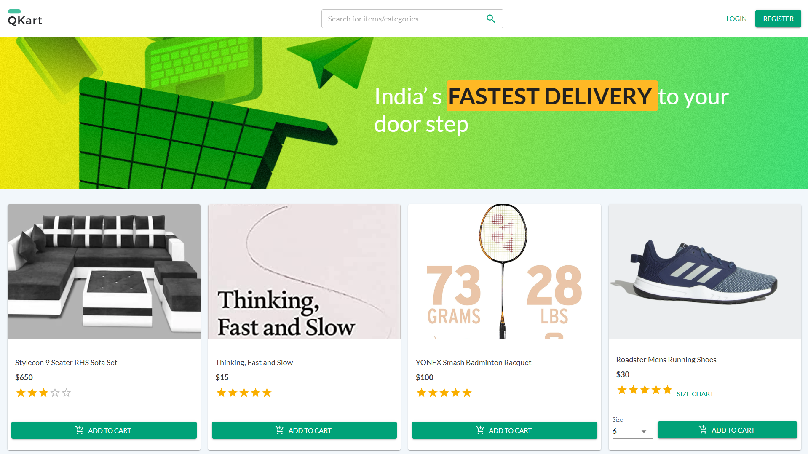
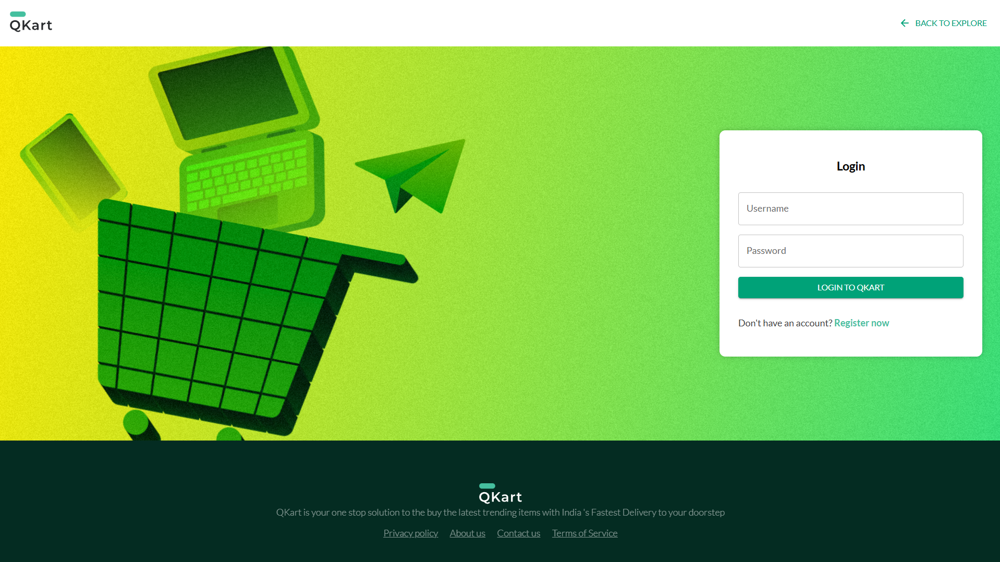
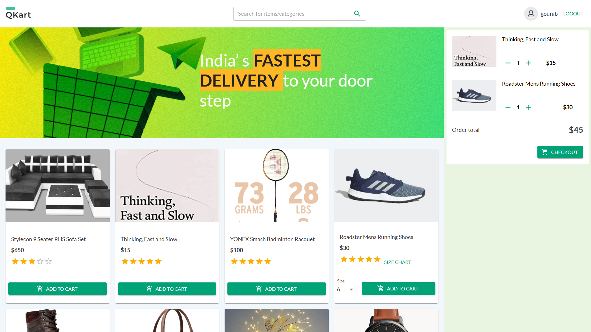
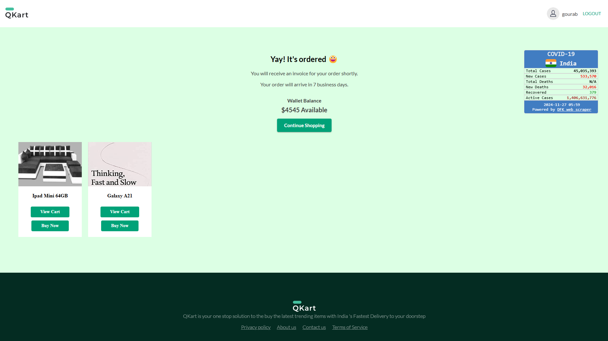

# 🛒 **Automating QKart E-commerce Platform**  

<p align="center">
  
  
  
  
  
</p>

## 🌟 **Project Overview**  
This project involves automating the testing process for **QKart**, an e-commerce platform, to ensure seamless functionality across various features such as user login, product search, cart management, and more.  

### Key Achievements:  
- Debugged failing test cases and issues with log statements.  
- Automated testing using **Selenium**.  
- Utilized **implicit and explicit waits** for synchronization.  
- Migrated tests to the **TestNG** framework.  
- Performed **Data-driven testing** with **Apache POI** for reading data from external sources.  

---

## 🚀 **Scope of Work**  

### 🛠 **Modularized Test Code & Debugging**  
- Modularized existing test cases for better readability and maintainability.  
- Fixed bugs on **Register** and **Login** pages.  
- Used IDE debugger with breakpoints to resolve issues efficiently.  

### 🔎 **Test Automation for Functionalities**  
- Automated product search, editing cart items, and persistence of cart content across sessions.  
- Reused common test steps, such as searching for products and adding items to the cart, for better maintainability.  

### ⏳ **Improved Test Synchronization**  
- Applied **implicit** and **explicit waits** for synchronization.  
- Implemented screenshot functionality before, after, and on errors during tests.  
- Performed automation tests that involve interacting with multiple **browser tabs** and **windows**.  

---

## 🛠️ **Skills & Technologies Used**  
- **Java** for test scripting.  
- **Selenium WebDriver** for web automation.  
- **XPath** for locating web elements.  
- **TestNG** for test automation framework.  
- **Apache POI** for data-driven testing.  
- **Developer Tools** for inspecting and debugging web elements.  
- **Implicit & Explicit Waits** for synchronization.  

---

## 📸 **Snapshots of the Work**  
### **QKart Shopping Interface (Products Page)**  
  

### **QKart Registration Page**  
  

### **QKart Login Page**  
  

### **QKart Product Page**  
  

### **QKart Order placed Page**  
  


---

## 📚 **How to Run the Automation**  
1. Clone this repository:  
   ```bash
   git clone https://github.com/Gourab-Pal/QKart_Automation.git
